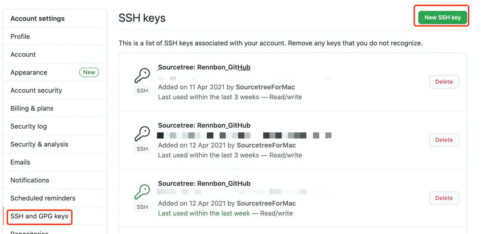

# github配置ssh及http使用ssh代理
## 1. 配置rsa证书
### 1.1 生成证书
```
$ cd ~/.ssh
# 生成rsa公私钥对
$ ssh-keygen -t rsa -C "your_email@example.com" -f github
```
### 1.2 将私钥添加到ssh-agent的缓存中
```
$ ssh-add ~./ssh/github
```
Tips: 如果出现Could not open a connection to your authentication agent.
执行`ssh-agent bash`



# 2. 尝试通过SSH下载代码
```
$ git clone git@github.com:filecoin-project/venus.git
```
# 3. 设置SSH config git策略
[ssh config概念](https://man.openbsd.org/ssh_config)
> 因为github.com SSH 使用的git@github.com，这里配置github.com使用git用户，这能避免一些特殊场景出现User混淆，通常这在一些自动化工具使用中经常碰到。
```
$ vim ~/.ssh/config

Host github.com
    IgnoreUnknown   UseKeychain,AddKeysToAgent 
    AddKeysToAgent yes
    UseKeychain yes
    HostName github.com   
    User git
    PreferredAuthentications publickey
    IdentityFile ~/.ssh/github
```


# 4. 彻底替换https为ssh
>执行以下全部指令后，所有的https的方式也会被重定向到SSH方式，所以github和本地的公私钥是连接两点的关键，如果之后有程序替换了本地的私钥，或者把github对应得公钥删了，那么都将无法git clone任何github的仓库了。
```
# 设置git url https请求替换为ssh方式
$ git config --global url."git@github.com:".insteadOf https://github.com/
# 查看之前git clone的库里面附带的https模块管理是否被git config instead 方案命中
$ git config -l 
url.git@github.com:.insteadof=https://github.com/
submodule.extern/filecoin-ffi.url=https://github.com/filecoin-project/filecoin-ffi.git
submodule.extern/test-vectors.url=https://github.com/filecoin-project/test-vectors.git
# 设置Github账户名全局策略
$ git config --global user.name <github name>
```
- <github name>就是github账户名，也可以使用github邮箱

# 如何还原配置
倒退流程
