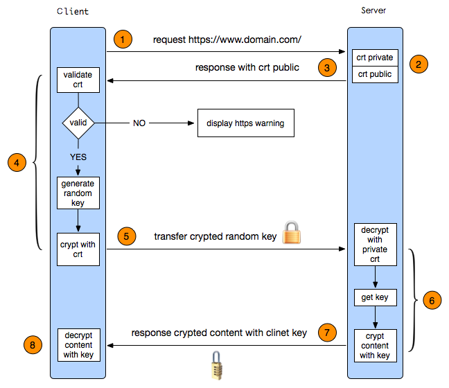

### X.590
公钥证书的格式标准，证书里包含有公钥、身份信息（如网络主机名，组织名称或个体名称等）和签名信息（可以是证书签发机构CA的签名，也可以是自签名 ）。

### HTTPS


### handshake_client.go
```
clientHelloMsg:{
raw  : "[]byte", //原始数据
vers : "uint16", //协议版本
random :"[]byte", //随机数32字节
sessionId :"[]byte", //会话ID，第一次为空，服务端借助会话ID恢复会话，需要服务器端缓存
cipherSuites:"[]uint16", //客户端支持的加密套件列表
compressionMethods :"[]uint8", //客户端支持的压缩方法，默认为null
nextProtoNeg :"bool", //扩展NPN 是否支持下次协议协商
serverName: "string", //扩展SNI 服务器名称，通常为域名，默认为目标地址主机名。支持SNI扩展需要的字段
ocspStapling:"bool", //扩展status_request 是否支持ocsp staping.全称在线证书状态检查协议，(rfc6960)，用来向 CA 站点查询证书状态 
supportedCurves:"[]CurveID",//扩展ellipic curve 列出支持的椭圆曲线名称  https://tools.ietf.org/html/rfc4492#section-5.5.1
supportedPoints: "[]uint8", //扩展Point Formats 对椭圆曲线顶点进行可选压缩
ticketSupported: "bool",//扩展Sessionticket.是否支持会话ticket
sessionTicket:"[]uint8",//扩展Sessionticket 会话ticket，区别于sessionId的新的会话恢复机制，这种机制不需要服务器端缓存。
supportedSignatureAlgorithms:"[]SignatureScheme", //支持的签名算法种类
supportedSignatureAlgorithmsCert:"[]SignatureScheme",//支持证书的签名算法种类
secureRenegotiationSupported:"bool",//。是否支持renegotiation_info扩展 安全重新协商
secureRenegotiation:"[]byte",//如果请求重新协商，就会发起一次新的握手
alpnProtocols : "[]string",//扩展ALPN 应用层协议协商。
scts :"bool", //扩展SCT。是否支持SCT
supportedVersions:"[]uint16",//支持的TLS版本
cookie                           []byte
keyShares                        []keyShare
earlyData                        bool
pskModes                         []uint8
pskIdentities                    []pskIdentity
pskBinders                       [][]byte
}
```
### 常用的扩展

1. 支持ECC需要两个扩展 ellipic curve，point formats
2. SNI扩展用来实现安全虚拟主机。单个服务器可能配有多个证书，服务端使用SNI来区分请求使用的是哪个证书。
3. SPDY使用NPN扩展协商使用何种应用层协议
4. HTTP2的协议协商过程使用ALPN扩展
5. ALPN是由客户端给服务器发送一个协议清单，由服务器来选择一个。NPN正好相反

### 加密套件
>查看本机支持的cipher suite列表

    openssl ciphers -V | column -t 
```
0xCC,0xAA  -  DHE-RSA-CHACHA20-POLY1305      TLSv1.2  Kx=DH    Au=RSA     Enc=ChaCha20-Poly1305  Mac=AEAD
0xFF,0x85  -  GOST2012256-GOST89-GOST89      SSLv3    Kx=GOST  Au=GOST01  Enc=GOST-28178-89-CNT  Mac=GOST89IMIT
0x00,0xC4  -  DHE-RSA-CAMELLIA256-SHA256     TLSv1.2  Kx=DH    Au=RSA     Enc=Camellia(256)      Mac=SHA256
0x00,0x88  -  DHE-RSA-CAMELLIA256-SHA        SSLv3    Kx=DH    Au=RSA     Enc=Camellia(256)      Mac=SHA1
0x00,0x81  -  GOST2001-GOST89-GOST89         SSLv3    Kx=GOST  Au=GOST01  Enc=GOST-28178-89-CNT  Mac=GOST89IMIT
0x00,0x9D  -  AES256-GCM-SHA384              TLSv1.2  Kx=RSA   Au=RSA     Enc=AESGCM(256)        Mac=AEAD
```

- Kx: 密钥交换算法
- Au: 认证算法
- Enc: 加密算法
- Mac: 消息认证码算法


```
# 根据客户端的ClientHello,填充ServerHello消息，主要的代码在hashshake_server.go/readClientHello()中

serverHelloMsg:{
    raw:"[]byte", //原始数据
    vers:"uint16", //服务端选择的版本号 通常为client server都支持的版本中最高的，common.go:mutualVersion()
    random:"[]byte", //服务端生成的随机数 32字节
    sessionId:"[]byte", //
    cipherSuite:"uint16", //服务端选择的加密套件 通常为client server都支持的陶建忠，最靠前的。 所以套件的顺序是有讲究的。
    compressionMethod:"uint8", // 选择的压缩方法 只会选择不压缩。 如果客户端不支持不压缩，会报错。
    nextProtoNeg:"bool", //client支持，则server支持
    nextProtos:"[]string", //服务端支持的应用层协议
    ocspStapling:"bool", 
    ticketSupported:"bool", 
    secureRenegotiationSupported:"bool", 
    secureRenegotiation:"[]byte",
    alpnProtocol:"string", //服务端选择的应用层协议，client server都支持的协议中，最靠前的。如果client端为空，则填充为服务器支持的协议
    scts:"[][]byte", //签名证书时间戳
    supportedVersion:"uint16", //支持的TLS版本
    serverShare:"keyShare", 
    selectedIdentityPresent:"bool",
    selectedIdentity:"uint16",
    
    // HelloRetryRequest extensions
    cookie:"[]byte",
    selectedGroup:"CurveID",
}


```

### Certificate
可选。携带X.509证书链，证书链以ASN.1 DSR编码的一系列证书。主证书必须第一个发送，中间证书按照正确的顺序跟在后面，根证书需省略。

证书需与选择的算法套件一致。
