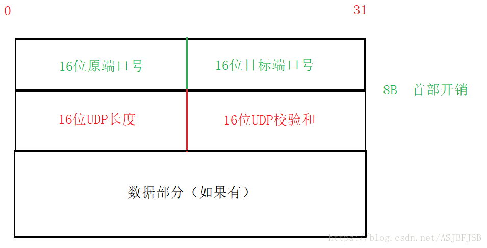

### 特点
1. UDP是无连接的，就是在发送数据之前不需要建立连接，只要知道对端的IP和Port就可以直接进行传输
2. UDP因为不保证可靠交付，所以UDP传输速度快，经常用于传送多媒体数据。
3. UDP传输数据最大长度为64K（包含首部）
```
udpheader:{
    SourcePort:"uint16", //源端口号
    DestPort:"uint16", //目标端口号
    Len:"uint16", //整个数据报 (UDP header + UDP data)的最大长度
    CheckSum:"uint16", //检查收到的数据的对错，校验不过直接抛弃
    Msg:"[]byte", //数据部分
}


```
>当传输的数据较大时，需要对数据在应用层手动的进行分包，多次的发送，并在接收端手动拼装
