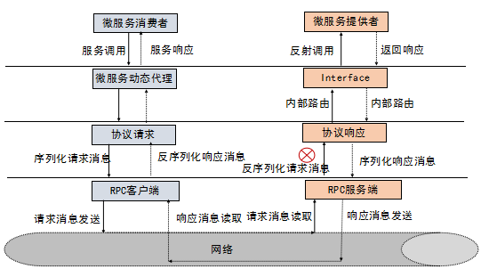

### RPC
全程remote procedure call,远程过程调用
### 什么是gRPC
gRPC是在HTTP/2之上实现的RPC框架，HTTP/2是第7层（应用层）协议，他运行在TCP（第4层-传输层）协议之上，相比于传统的http有诸多优点：
- 基于HTTP/2之上的二进制协议（Protobuf序列化机制）
- 一个连接上可以多路复用，并发处理多个请求和响应
- 多种语言的类库实现
- 服务定义文件和自动代码生成（.proto文件和Protobuf编译工具）//这是优缺点
- gRPC提供了很多扩展点，如开放负载均衡接口可以无缝的与第三方组件进行集成对接
