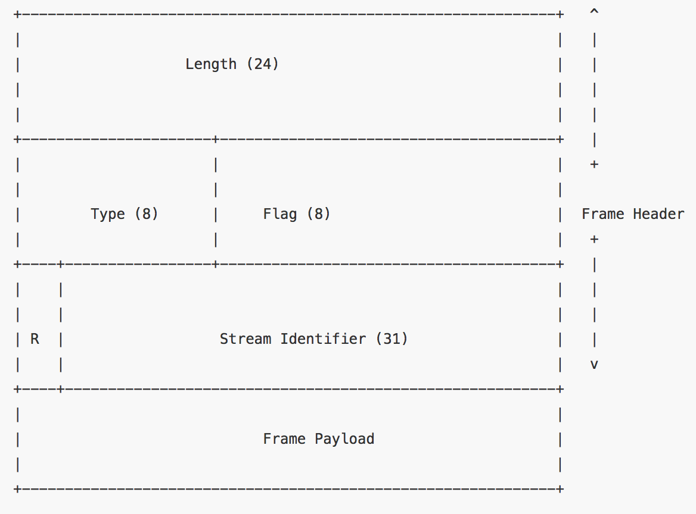

### 请求


### 响应


### 状态码


```
200: ok
400: 客户端请求的语法错误，服务器无法解析
401: 请求要求用户的身份认证
404: 无法根据请求找到资源
500: 服务器内部错误，无法完成请求
502: 网关或代理工作的服务器尝试执行请求时，从远程服务器接收到一个无效响应
504: 充当网关或代理的服务器，请求超时
```


### HTTP2
1. HPACK
2. Server Push
3. 帧结构


#### 二进制帧层

性能提升的核心在于二进制帧层.它指HTTP消息在客户端和服务端如何封装和传输.




二进制帧是9字节（72bit）= 3+1+1+4 = 9
```js
http2FrameHeader:{
	valid:"bool", // caller can access []byte fields in the Frame
	
	// Type is the 1 byte frame type. There are ten standard frame
	// types, but extension frame types may be written by WriteRawFrame
	// and will be returned by ReadFrame (as UnknownFrame).
	Type:"http2FrameType",
	// Flags are the 1 byte of 8 potential bit flags per frame.
	// They are specific to the frame type.
	Flags:"http2Flags",
	// Length is the length of the frame, not including the 9 byte header.
	// The maximum size is one byte less than 16MB (uint24), but only
	// frames up to 16KB are allowed without peer agreement.
	Length:"uint32",
	// StreamID is which stream this frame is for. Certain frames
	// are not stream-specific, in which case this field is 0.
	StreamID:"uint32"
}
```
### 结构体
名称|长度|描述
---|---|---
Length|3字节|表示帧负载的长度（取值范围为2^14 ~ 2^24-1 字节）。请注意，2^14字节是默认的最大帧大小，如果需要更大的帧，必须在SETTINGS帧中设置
Type|1字节|当前帧类型
Flags|1字节|具体帧类型的标识
R|1位|保留位，不要设置，否则可能带来严重后果
Stream Identifier|31位|每个流的唯一ID
Frame Playload|长度可变|真实的帧内容，长度是在Length字段中设置的

### 帧类型
名称| ID  |描述
---|-----|---
DATA|0x0|传输流的核心内容
HEADERS|0x1|包含http首部，和可选的优先级参数
PRIORITY|0x2|指示或者更改流的优先级和依赖
RST_STREAM|0x3|允许一端终止流（发送RST_STREAM以请求取消流或指示发生了错误情况。）
SETTINGS|0x4|协商连接级参数
PUSH_PROMISE|0x5|提示客户端，服务器要推送些东西
PING|0x6|测试连接可用性和往返时延（RTT）
GOAWAY|0x7|告诉对端，当前段已结束
WINDOW_UPDATE|0x8|协商一端将要接受多少字节（用于流量控制）
CONTINUATION|0x9|用以扩展HEADER数据块

### 优先级


### server push


####标头压缩


> 使用HPACK压缩格式压缩请求和响应标头源数据
1. 这种格式支持通过静态霍夫曼代码对传输标头字段进行编码，从而减少各个传输的大小
2. 这种格式要求客户端和服务器同时维护和更新一个包含之前见过的标头字段的索引列表（就是它可以建立一个共享的压缩上下文），此列表随后会用作参考，对之前的传输的值进行有效编码。

- 静态字典表：由61个常规header域和一些预定义的values组成预定义字典表
- 动态字典表：在连接中遇到的实际header域的列表。这个字典表有大小限制，新来的key进来，旧的key可能会被移除。
- Huffman编码：是一个特殊二叉树，最大压缩比为 8:5
