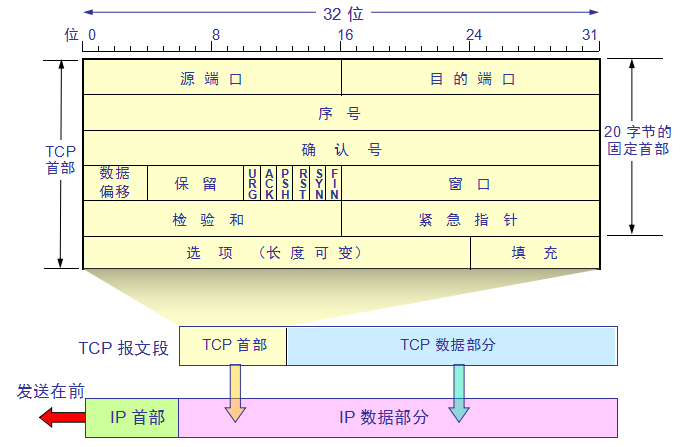

1. 20个字节固定头部结构
2. 40（最多）个字节头部选项字段

```
tcpheader:{
    SourcePort:"uint16", //源端口号, 告知主机该报文段来自哪里
    DestPort:"uint16", //目标端口号，传给某个上层协议或者应用程序
    
    //序列号，开启TPC会话时，被系统初始化为某个随机ISN，
    //后续的TCP报文中序号加上该报文段所携带数据的第一个
    //字节在整个字节留中的偏移。如，某个TCP报文传送的数据
    //是字节流中的[1025~2048]字节，那么该报文段的序号为
    //ISN+1025
    SeqNum:"uint32", 
    
    //确认号，接收端用来通知发送端某个或几个报文段接收成功
    AckNum:"uint32", 
    //数据偏移及flag等 
    HeaderLenAndFlag:"uint16", 
    //表示想收到的每个TCP数据段的大小
    Window:"uint16",
    //检验和，由发送端填充，接受端对TCP报文段执行CRC算法
    //以检验TCP报文段在传输过程中是否损坏
    CheckSum:"uint16",
    //紧急指针，指向后面是优先数据的字节，在URG标志设置了时
    //才有效。如果URG标志没有被设置，这里作为填充。加快处理标示为紧急的数据段。
    UrgentPointer:"uint16",
    
}

HeaderLenAndFlag
[0,4) 头部长度偏移量，指示何处数据开始
[4,10) reserved   //保留位，必须0
10  URG   //紧急指针是否有效
11  ACK   //确认号是否有效  确认报文段
12  PSH   // 提示接收端，从TCP接受缓冲区中读走数据
13  RST   //要求对方重新建立连接  复位报文段
14  SYN   //请求建立一个连接 同步报文段
16  FIN   //通知对方本端要关闭连接 结束报文段


选项与填充（必须为4字节整数倍，不够补0）:
最常见的可选字段的最长报文大小MSS（Maximum Segment Size）,每个连接方通常都在一个报文段中指明这个选项。
他指明本端所能接收的最大长度的报文段。该选项如果不设置，
默认为536（20+20+536=576字节的IP数据包）

```

### 握手成功后数据传输
1）发送数据：服务器向客户端发送一个带有数据的数据包。该数据包中的序列号和确认号与建立连接第三步的数据包找那个的序列号和确认号相同。

2）确认收到：客户端收到该数据包，向服务器发送一个确认数据包。该数据包中，序列号是为上一个数据包中的确认号值，而确认号为服务器发送的上一个数据包中的序列号+该数据包中所带数据的大小。

```
c -> s   [Seq=10 Ack=1 Win=65700 Len=13]
s -> c   [Seq=1 Ack=23 Win=65536 Len=0]

Seq=previous Ack   
Ack=previous Seq + prvious Len

2轮一周期滚动窗口，类似注册师考试滚动机制
```

### 端口
端口|服务
---|---
21|FTP文件传输协议
22|SSH安全登录，文件传送(SCP)和端口重定向
23|Telnet
25|SMTP
69|TFTP
79|inger Finger
80|HTTP
88|Kerberos Authenticating agent
110|POP3
113|ident old identification server system
119|NNTP
220|IMAP3
443|HTTP3

