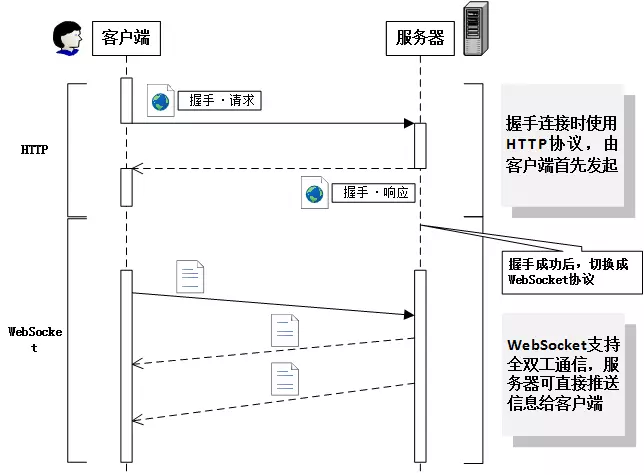

###  握手协议
#### 请求
```
GET /chat HTTP/1.1
Host: server.example.com
Upgrade: websocket  //表示升级到websocket协议
Connection: Upgrade //表示要升级协议
Sec-WebSocket-Key: dGhlIHNhbXBsZSBub25jZQ==
Origin: https://example.com
Sec-WebSocket-Protocol: chat, superchat
Sec-WebSocket-Version: 13 //ws版本。


- 第一行为请求的方法，类型必须为GET，协议版本号必须大于1.1
- Upgrade字段必须包含，值为websocket
- Connection字段必须包含，值为Upgrade
- Sec-WebSocket-Key字段必须包含 ，记录着握手过程中必不可少的键值。
- Sec-WebSocket-Protocol字段必须包含 ，记录着使用的子协议
- Origin：作安全使用，防止跨站攻击，浏览器一般会使用这个来标识原始域

```


#### 响应
服务器接收到请求后，返回状态码为101 Switching Protocols 响应

```
HTTP/1.1 101 Switching Protocols
Upgrade: websocket
Connection: Upgrade
Sec-WebSocket-Accept: s3pPLMBiTxaQ9kYGzzhZRbK+xOo= 
Sec-WebSocket-Protocol: chat

- Sec-WebSocket-Accept 的val是根据客户端请求的Sec-WebSocket-Key计算所得
  - 将key与258EAFA5-E914-47DA-95CA-C5AB0DC85B11拼接
  - 通过SHA1计算出摘要，并转成base64字符串


```
### 数据帧格式
客户端和服务器端成功握手后即可进行双向数据传输，在了解数据传输前，先来看下Websocket协议的数据帧格式：

    0                   1                   2                   3
    0 1 2 3 4 5 6 7 8 9 0 1 2 3 4 5 6 7 8 9 0 1 2 3 4 5 6 7 8 9 0 1
    +-+-+-+-+-------+-+-------------+-------------------------------+
    |F|R|R|R| opcode|M| Payload len |    Extended payload length    |
    |I|S|S|S|  (4)  |A|     (7)     |             (16/64)           |
    |N|V|V|V|       |S|             |   (if payload len==126/127)   |
    | |1|2|3|       |K|             |                               |
    +-+-+-+-+-------+-+-------------+ - - - - - - - - - - - - - - - +
    |     Extended payload length continued, if payload len == 127  |
    + - - - - - - - - - - - - - - - +-------------------------------+
    |                               |Masking-key, if MASK set to 1  |
    +-------------------------------+-------------------------------+
    | Masking-key (continued)       | Payload Data                  | 
    +-------------------------------- - - - - - - - - - - - - - - - + 
    |  Payload Data continued ...                                   |
    +---------------------------------------------------------------+
    |  Payload Data continued ...                                   |
    +---------------------------------------------------------------+
数据格式中定义了opcode、mask、payload length、Payload data等字段。其中要求：

    1. 客户端向服务器传输的数据帧必须进行掩码处理。服务器若接收到未经过掩码处理的数据帧，则必须主动关闭连接。
    2. 服务器向客户端传输的数据帧一定不能进行掩码处理。客户端若接收到经过掩码处理的数据帧，则必须主动关闭连接。

其中数据格式中比较重要的区域在前两个字节，即FIN、RSV1、RSV2、RSV3、OPCODE、MASK和payload length：

    - FIN：标识是否为此信息的最后一个数据包，占1bit;
    - RSV1、RSV2、RSV3: 备用，默认0，各占1bit
    - OPCODE: 定义数据包类型，占4bit，WebSocket中有如下数据包:
        - 0x0：标识一个中间数据包 
        - 0x1：标识一个text类型数据包
        - 0x2：标识一个binary类型数据包 
        - 0x3-7：保留 
        - 0x8：标识一个断开连接类型数据包
        - 0x9：标识一个ping类型数据包 
        - 0xA：表示一个pong类型数据包 
        - 0xB ~ 0xF：保留
        
    - MASK: 标识PayloadData是否经过掩码处理，占1bit。
      MASK如果是1，Masking-key域的数据即是掩码密钥，
      用于解码PayloadData。客户端发出的数据帧需要进行掩码处理，
      所以此位是1。
      
    - Payload len:标识Payload Data的长度，占7bits，
      如果Payload Data经过扩展，那么Payloadlen占
      7bits+16bits或7bits+64bits.
        - 如果其值在0-125，则是payload的真实长度。
        - 如果值是126，则后面2个字节形成的16bits无符号整型数的值是payload的真实长度。
        - 如果值是127，则后面8个字节形成的64bits无符号整型数的值是payload的真实长度。
